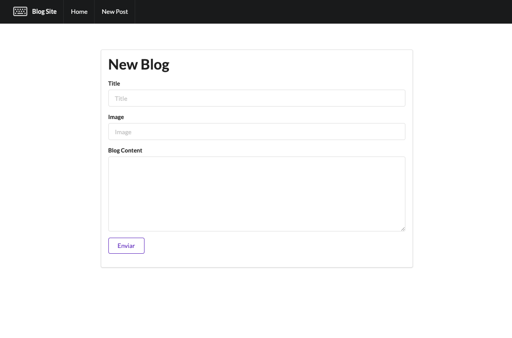
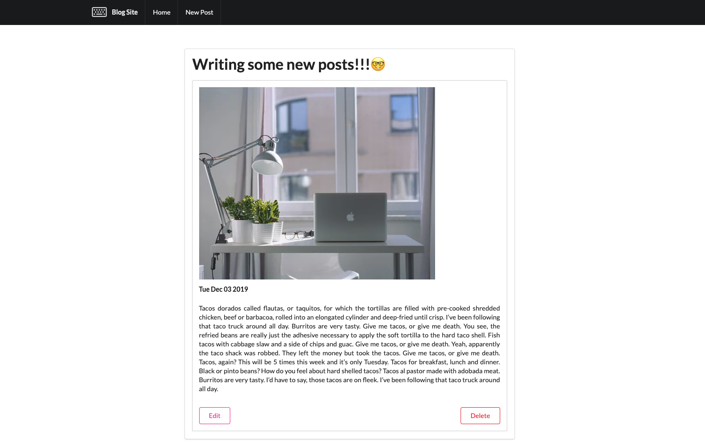

# express-blogApp
###Description
Blog app built with express and ejs.






### Prerequisite
* node
* npm
* mongo db locally running


## Quick Start
Clone repository

``` bash
cd ./repositorypath

npm install

node app.js

```

Open localhost 3000 in your browser.

